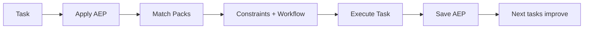

# AEP - Agent Experience Protocol

Stop repeating yourself to AI. Save what worked. Reuse it forever.

_Experimental spec: v1.0-exp_


**AEP saves successful AI workflows in your repo so future runs start aligned instead of from zero.**

---

## Why this exists

Every AI session starts from scratch.

You keep repeating:

- "do not redesign the layout"
- "reuse the existing CSS"
- "keep this practical, not over-engineered"

...even when you already solved this exact task last week.

**AEP fixes that.**

Save what worked once. Reuse it forever across sessions, tasks, and agents.

## How AEP works

```text
Task -> Successful outcome -> Save AEP -> Future tasks start aligned
```

---

## Example: HTML -> Next.js

## ⚡ Before vs After

| Without AEP | With AEP |
|------------|---------|
| Repeat instructions every time | Reuse saved patterns |
| 10-20 corrections | 1-2 iterations |
| Inconsistent outputs | Consistent results |
| High token usage | Lower cost |

> AEP makes AI behave like it already learned your preferences.

### Real prompt example

Without AEP, you usually say:

> "Convert this HTML landing page to Next.js. Do not redesign. Keep CSS. Avoid premature componentization."

With AEP, you say:

> "Use the AEP skill and apply packs for HTML -> Next.js before you start."

And the agent starts with your intent, constraints, workflow, and checks already loaded.

---

## Quick Start

Tell your agent:

- "Use the AEP skill and save this collaboration as `html-to-nextjs-migration`."
- "Use the AEP skill and apply relevant packs before you start."
- "Use the AEP skill and explain which AEPs are active right now."

AEP packs live in `.agent/aep/` as repo-local JSON.

### Install via Smithery

Install page: [smithery.ai/skills/Robi-Labs/aep](https://smithery.ai/skills/Robi-Labs/aep)

Install with Skills CLI:

```bash
npx @smithery/cli@latest skill add Robi-Labs/aep
```

You can also install directly from the Smithery skill page into your agent of choice.

---

## What you can use AEP for

- Convert HTML -> Next.js without redesign
- Write consistent landing page copy
- Generate UI that matches your style
- Reuse backend refactor patterns
- Standardize team workflows across projects

## Why people use AEP

- Less repetition
- Better first drafts
- Consistency across tools
- Lower token cost over time

---

## 🔄 AEP Flow



## 📦 Repo structure

```text
.agent/
  aep/
    index.json
    project.aep.json
    user.aep.json
    tasks/
```

## 📈 What improves over time

```text
Time ->
          ________
Quality  /
        /
       /
      /
_____/________________

With AEP: improves over time
Without AEP: resets every session
```

---

## Technical details

### What is in `aep-exp/`

- `SKILL.md`  
  v1.0-exp behavior for an AEP-aware agent
- `references/schema.v1.md`  
  full pack and index schema for `version: "1.0-exp"`
- `references/integration-notes.v1.md`  
  integration guidance for matching, scoring, and compatibility
- `references/prompt-patterns.v1.md`  
  prompt patterns for save/apply/promote/inspect flows
- `assets/templates/`  
  template files for project/user/task/index

### v1.0-exp adds (on top of v0.1)

- Better matching:
  - `applies_to.languages`, `frameworks`, `paths`, `domains`
  - `strength` score per pack
- Lightweight analytics:
  - `metrics.times_applied`, `first_used_at`, `last_used_at`, `avg_turns_saved`
- Pack evolution:
  - `history` events
  - optional `merge_suggestions`

Everything stays repo-local, file-only, and agent-agnostic.

### Wiring it into a repo

1. Create:

```text
.agent/
  AGENTS.md
  aep/
```

2. Copy templates:

- `aep-exp/assets/templates/project.aep.json` -> `.agent/aep/project.aep.json`
- `aep-exp/assets/templates/user.aep.json` -> `.agent/aep/user.aep.json`
- `aep-exp/assets/templates/index.json` -> `.agent/aep/index.json`
- optionally:
  - `aep-exp/assets/templates/task.generic.aep.json` -> `.agent/aep/tasks/<task>.aep.json`

3. Agent behavior:

- read `.agent/AGENTS.md`
- read `.agent/aep/*.json`
- follow `aep-exp/SKILL.md`

---

## Links

- `aep-exp/SKILL.md`
- `aep-exp/references/schema.v1.md`
- `aep-exp/references/integration-notes.v1.md`
- `aep-exp/references/prompt-patterns.v1.md`


